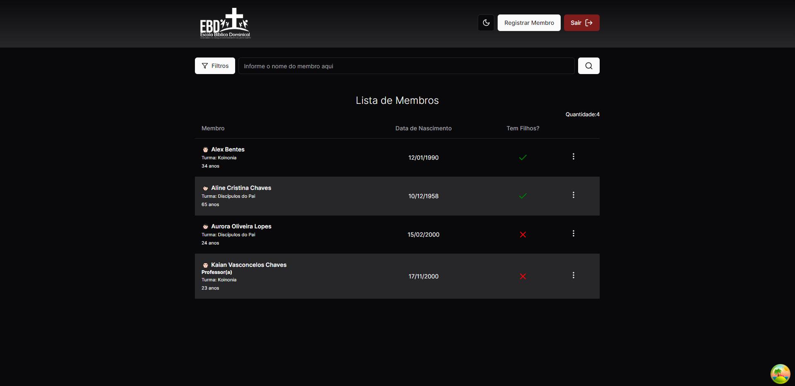
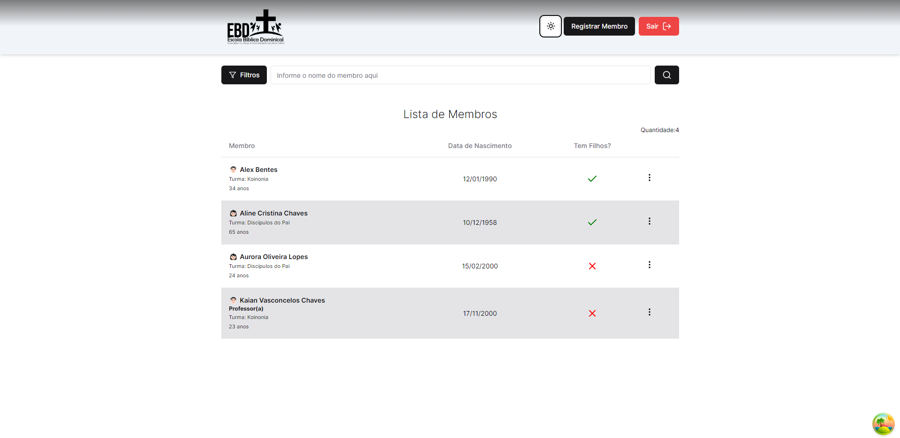
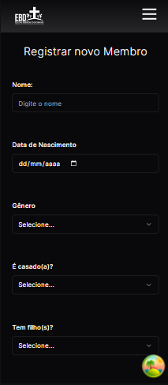
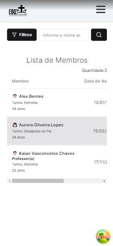

<h1 align="center" style="font-weight: bold;">Member EBD</h1>

<p align="center">
 <a href="#tech">Technologies</a>
 <a href="#started">Getting Started</a>
</p>

<p align="center">
    <b>O projeto em questão tem como objetivo auxiliar a gerência dos alunos da EBD e a tomada de decisão.</b>
</p>

<h2 id="layout">🎨 Layout</h2>

<p align="center">
    
    
    
    
</p>

<h2 id="technologies">💻 Technologies</h2>

- nodejs
- express
- typescript
- prismaORM
- postgres
- zod
- bcrypt
- jsonwebtoken
- nextjs
- react
- tailwindcss
- shadcn-ui
- tanstack-query
- react-hook-form
- next-auth

<h2 id="started">🚀 Getting started</h2>

```bash 
npm install
```

<h3>Prerequisites</h3>

- [NodeJS](https://github.com/)


<h3>Cloning</h3>


```bash
git clone https://github.com/KaianDev/member-ebd
```

<h3>Starting</h3>


```bash
cd member-app
npm run dev
```

